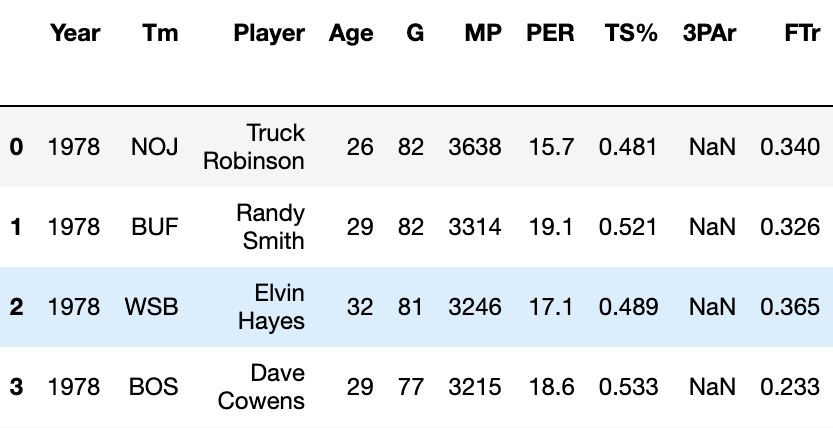
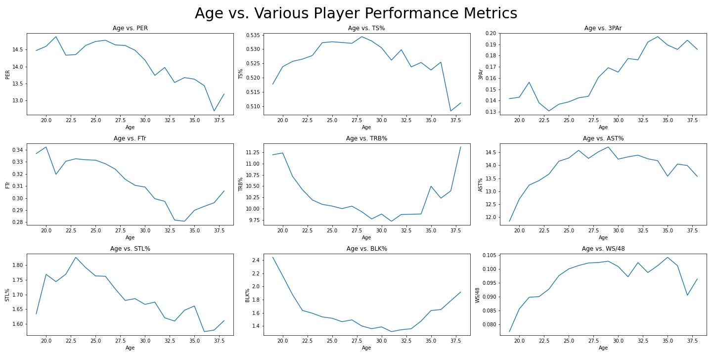
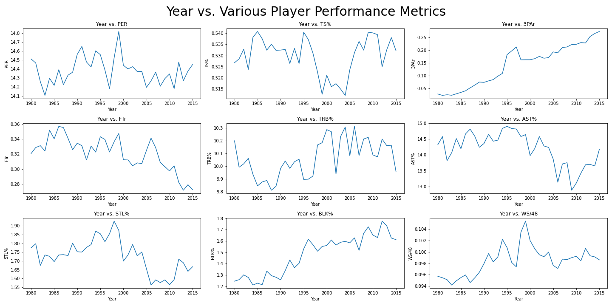
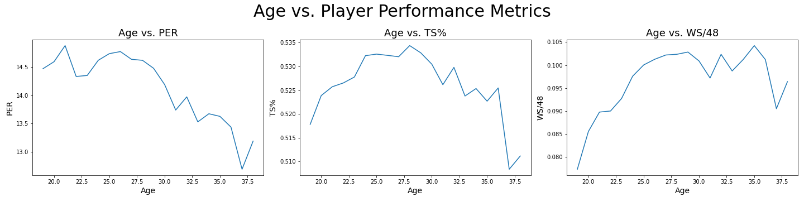
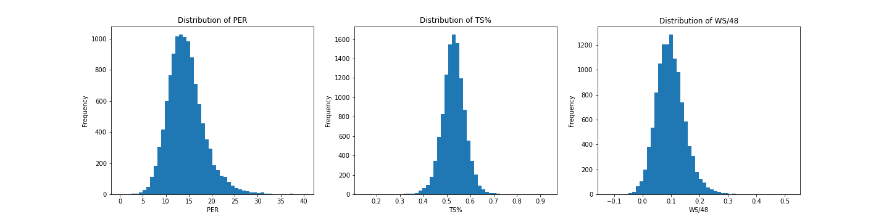
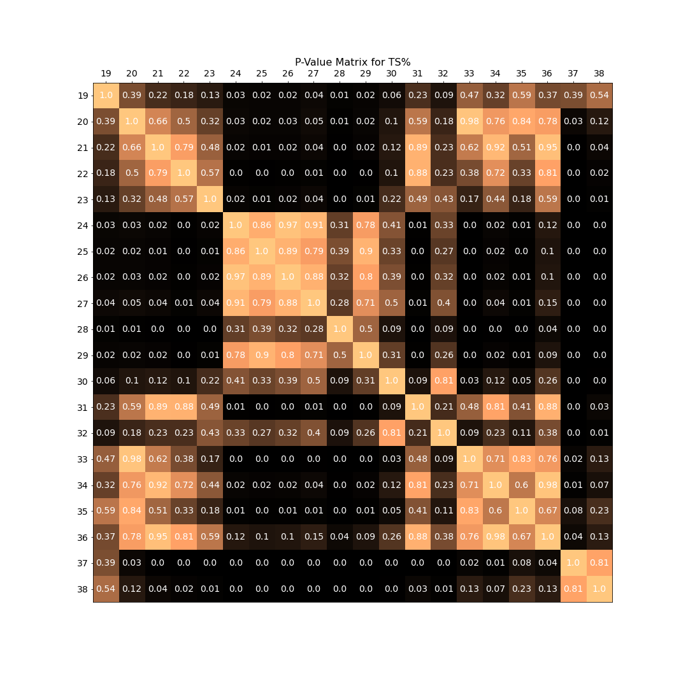
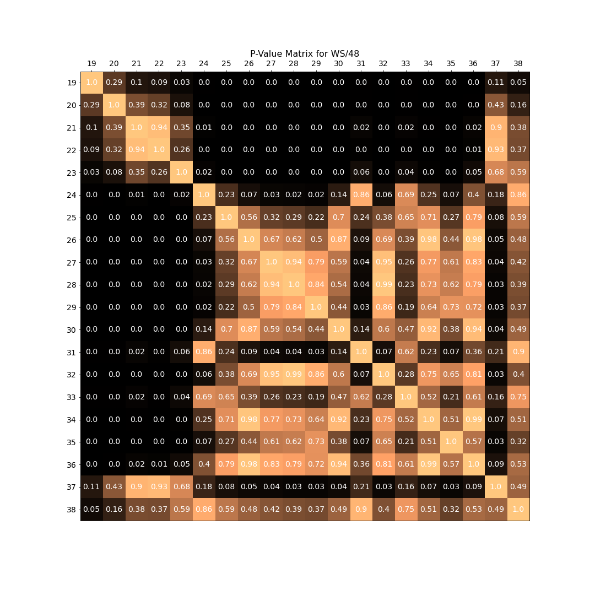

# NBA-age-analysis
A repository containing resources, processes and findings for my NBA age analysis.

## Motivation
NBA players sign multi-million dollar contracts every year. But how can we tell if the length and amount of these contracts are justified? This project will take a dive into how age affects performance in the National Basketball Association in an attempt to determine a 'peak' age and sort age groups by different performance metrics. 

## The Data
This is a public data set published at https://data.world/jgrosz99/nba-player-data-1978-2016 by Justin Grosz. It contains 17,709 rows and 109 columns and is saved as a .csv file. The data set contains every advanced statistic for every player each year from the years 1978-2016, as well as the number of games/minutes they played, their team, their age and their salaries.

## Exploratory Data Analysis
### Initial Findings
Upon examining the data after loading it into a pandas data frame, we can see that there are a number of missing values in certain columns. 

Attempting to remove rows with missing values results in roughly 700 rows remaining, less than 5% of the original number of entries. To account for this, we will look at how age trends with a few metrics popular metrics located in the beginning of the data frame. The metrics in question are PER, TS%, 3PAr, FTr, TRB%, AST%, STL%, BLK%, WS/48. Since most other metrics located in the rest of the data frame are either combinations or variations of other metrics, we can choose to exclude them.


### Cleaning the Data
When exploring the data, entries within 2016 were notable in that they had incomplete game data for that season. We decided to remove this data as the nature of advanced stats tend to be more variant with small game sample sizes, this can lead to abursdly high and low numbers that aren't representative of a player's season-long performance.  We also narrowed down our columns to the features we mentioned above and removed entries with missing values in these columns. This can be done with the iloc method to slice relevant features:
``` .iloc([:,[0,1,2,3,4,5,6,7,8,9,10,11,12,13,14,15,21,22]])```

This left us with 11,539 rows from the original data set. In addition, when grouping by age, the ages of 18 and 39+ had to few entries too show a meaningful distribution, so we narrowed our scope to ages with a sample size of 50 or greater. We then showed how age varies over these relevant metrics using the groupby method 

As we can see, age seems to possess some type of effect on these metrics. Another thing to consider is if these metrics change as the game evolves year by year. 

The plots above demonstrate that certain metrics such as 3PAr and BLK% trend upwards as the years pass, suggesting that these may not be reliable metrics to consider.

### Relevant Metrics
After cleaning the data we can narrow down our relevant features to three metrics to measure player performance, Player Efficiency Rating (PER), True Shooting Percentage (TS%), and Win Share per 48 Minutes (WS/48). These metrics measure overall player production, shooting ability, and win contributions respectively, three different ways to measure 'player performance'. We will attempt to find a commonality on how age affects these various metrics. 

## Analysis
### Distributions
We begin by taking a look at the distribution of these metrics(picture). We can clearly see that the distribution for our population is approximately normal for all three of these metrics. Since normal distributions are pretty typical for sums and averages, it is imporant to note that these metrics are in fact weighted sums of other metrics. 

The following function was utilized during this process to make histograms in a timely fashion:
```
def plot_distribution(data,stat,ax):
    if len(data) > 2500:
        ax.hist(data[stat],bins = 50)
    else:
        ax.hist(data[stat],bins = int(len(data)**0.5))
 ```       

### Hypothesis Tests
For this experiment, we will attempt to see if there is a significant difference in the average performance level of a player between certain age groups.
We can state the following:

Null Hypothesis: There is NO difference in performance level for the relevant metrics between ages and age groups.
Alternative Hypothesis: There IS a difference in performance level for the relevant metrics between ages and age groups.

### Relevant Functions
The following function slices data by age range and the desired statistic:
```
def age_slice(data,age,stat,end = 0):
    if end != 0:
        data_out = data[(data['Age'] == age)] 
        for num in range(age + 1,end + 1):
            data_add = data[(data['Age'] == num)]
            data_out = pd.concat([data_out,data_add])
        return data_out[stat]
    data_out = data[(data['Age'] == age)] 
    return data_out[stat]
```

The following function generates t-test p-values across a range of values (in this case age) and saves them into a matrix:
```
def p_value_matrix(data, stat, start, end, step = 1):
    p_values = []
    for num1 in range(start,end+1,step):
        for num2 in range(start,end+1,step):
            _,p = stats.ttest_ind(age_slice(data,num1,stat,num1+(step-1)), age_slice(data,num2,stat,num2+(step-1)))
            p_values.append(p)
    np.array(p_values).reshape(int((end-start+1)/step),-1)
    return np.array(p_values).reshape(int((end-start+1)/step),-1)
 ```
 
 The following function creates heatmaps from the provided p-value matrix:
 ```
 def make_heatmap(matrix, stat, start, end, labels = 0):
    fig, ax = plt.subplots(figsize = (15,15))
    im = ax.imshow(matrix, cmap = 'copper')

    ax.set_xticks(range(len(matrix)))
    ax.set_yticks(range(len(matrix)))
    if labels == 0:
        ax.set_xticklabels(np.arange(start,end+1), size = 14)
        ax.set_yticklabels(np.arange(start,end+1), size = 14)
    else:
        ax.set_xticklabels(labels, size = 14)
        ax.set_yticklabels(labels, size = 14)
    ax.xaxis.tick_top()
    ax.set_title('P-Value Matrix for {stat_title}'.format(stat_title = stat),size = 16)

    for i in range(len(matrix)):
        for j in range(len(matrix)):
            text = ax.text(j, i, round_down(matrix[i, j],2),
                       ha="center", va="center", color="w", size = 14)
```
 

### Process
Since the population is approximately normal and we are testing if there is a significant difference in the means of these statistics, we will utilize a T-test to determine if our null hypothesis can be rejected. However, since we are testing how an age or age group's mean performance is significantly different from a large number of other ages/age groups, it would be more appropriate to plot a p-value matrix. Utilizing a function for creating heatmaps, we produced three p-value 'heatmaps' for our relevant statistics. 

Here, we would like to use an alpha level of 0.05. Conducting a power test on instances in which we reject the null hypothesis, the statistical power is generally above 99%. We can interpret our p-values as the probability of observing results as or more extreme than our hypothesis test conclusion. Upon looking at the standard deviations of the data, we cannot assume equal variance, so we will be utilizing the Welch's T-test.

### Findings

Our heatmap for PER demonstrates that there is a large difference in player productivity at age 30. Looking on our earlier Age vs. PER plot verifies that this is associated with a decline in performance. In addition, younger players seem to perform closer to the median age of 26. 

Our heatmap for TS% looks much different. There are clearly defined age groups (represented by the light squares) in which the p-value is not rejected. This suggests some commonality in shooting performance within these clusters of ages. Similary to PER, however, we can note that there is a steep decline at around age 30. 

Our heatmap for WS/48 demonstrates a different trend from the previous metrics. There is a large change in performance at age 23, but this instead is associated with an increase in performance. In addition, we can see that there that older players tend to perform more similarly to the median age. 

### Conclusions

We can conclude that while there is not significant difference in player performance across every age specified in our range, we can visualize that there are distinct ages/age groups that can reject the null hypothesis when compared to others. This suggests that there is in fact a significant difference in player performance across different age groups, and our peak age can be pinned down to 24 to 30 (the cluster that fails to reject the null hypothesis but has the highest average amongst each other).
